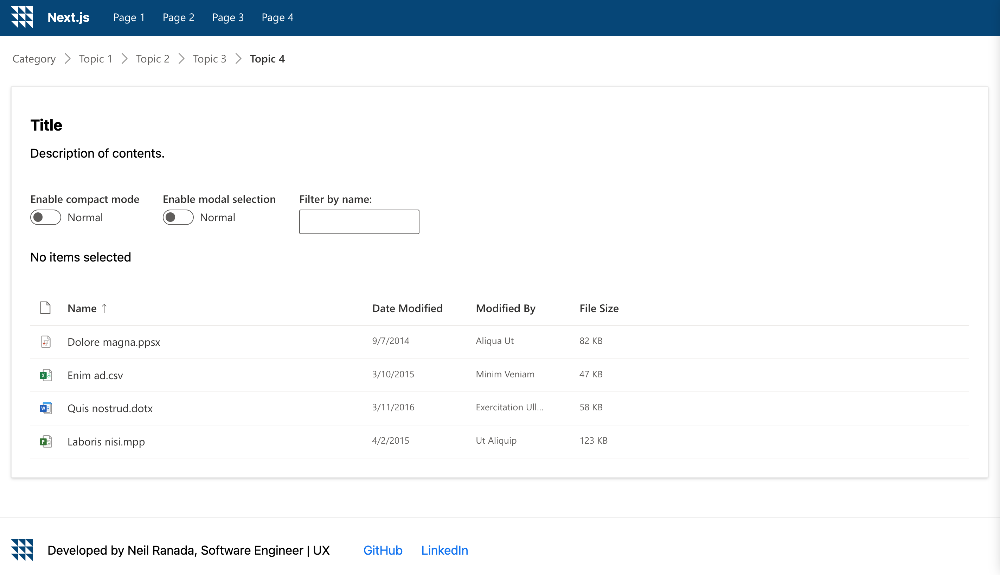

# Welcome to Next.js Dashboard
***

## Task
This will be a dashboard application template using Next.js, React.js, TypeScript, and Microsoft's Fluent UI design components.

## Description
This dashboard project is currently under development, starting with a list view using the following technologies:
1. Next.js
2. React.js
3. Typescript
4. Microsoft's Fluent UI design components

## Installation
Steps:
1. Download this project manually or use terminal: `git clone https://github.com/Ranada/nextjs_dashboard`
2. Navigate to the directory containing nextjs_dashboard: `cd nextjs_dashboard`
3. Run the nextjs_dashboard app: `npm run dev`

## Usage
This Next.js dashboard has limited functionality at this time.

## Have recommendations? Want to chat about programming and other good stuff? Let's connect.
neil.ranada@gmail.com  
https://www.linkedin.com/in/neilranada/

### The Core Team
Neil Ranada, Software Engineer | UX

